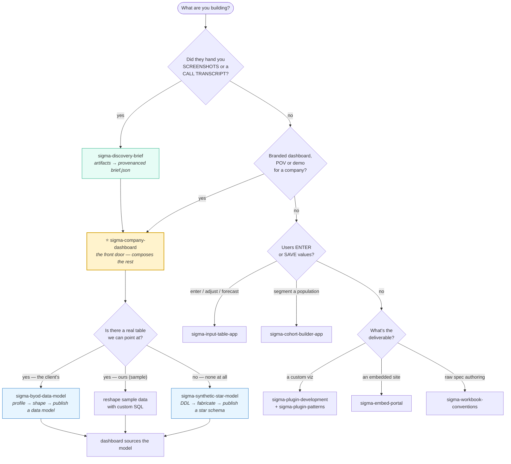
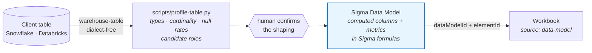
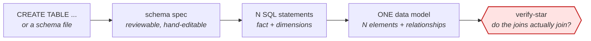
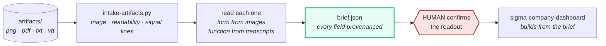
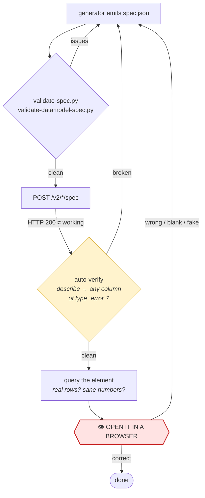
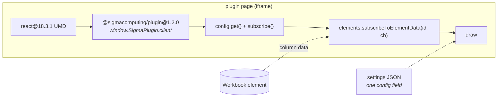

# customdemo

A Claude Code **plugin** for building Sigma Computing assets from code — branded
workbooks and dashboards, data models, data apps, embed portals, and custom
visualization plugins. Install it once and every skill below becomes available in
any project.

Twelve skills, a set of REST/MCP helper scripts, and ten worked plugin examples.
Everything here is authored against the **verified** shape of the Sigma API — the
reference docs record what was actually observed on a live org, including the
places where the endpoint accepts something and then silently does nothing with it.

---

## Which skill do I use?



> ⚠️ **Common mistake:** driving a company build from `branded-dashboard-format` +
> the building blocks by naming them in your prompt. That yields a *generic*
> dashboard — no fetched logo, no bespoke plugin. Just say:
> **"Use `sigma-company-dashboard` to build a Sigma workbook for \[Company]."**

---

## Skills

| Skill | What it does |
|---|---|
| ⭐ **sigma-company-dashboard** | **START HERE.** End-to-end branded workbook: real fetched logo, brand-gradient header, comparative gradient KPI cards, a live CallText AI insight, charts + filters, a **bespoke domain plugin**, and a second interactive page. Ships the verified API cheatsheet, the six-layout catalog, and the canonical generator. |
| **sigma-discovery-brief** | **They brought artifacts, not answers.** Read screenshots of their existing dashboard and the discovery-call transcript, and turn them into a reviewable `brief.json` — layout, KPIs with a comparison basis, pages, plugin concept, page-2 pattern — where every field cites the artifact that justifies it. Screenshots decide FORM, transcripts decide FUNCTION; numbers on a tile are reproduced as a *shape*, never as values. |
| **sigma-byod-data-model** | **Bring your own data.** Profile a client's warehouse table (types, cardinality, null rates, date range, candidate roles), agree a shaping, publish a real Sigma **data model as code**. Emits **no warehouse SQL** — verified identical on Snowflake and Databricks. |
| **sigma-synthetic-star-model** | **No data at all.** Fabricate a domain dataset from a pasted DDL or schema file — one SQL statement per table — and publish it as a star schema: a fact plus dimensions wired by real `relationships`. Deterministic (no RNG), shaped (trend, seasonality, category effects), labelled SYNTHETIC in six places, and verified by actually joining it. Works on Snowflake and Databricks from one spec. |
| **sigma-input-table-app** | Interactive data apps: input tables, buttons, action sequences, modals — scenario modelers, forecasting, planning, write-back, submit→approve. |
| **sigma-cohort-builder-app** | Agent-driven population segmentation — filter to a named cohort, save it, compare saved cohorts. One agent tool per filter dimension. |
| **sigma-workbook-conventions** | Spec mechanics: element shapes, layout XML, ID semantics, control catalog, and the POST-time gotchas. |
| **sigma-workbook-styling** | The visual-craft layer, and **authoritative for theme** — the full `themeOverrides` reference and its rendering traps. |
| **branded-dashboard-format** | The `analyst-detail` house layout + a fill-in brand-kit template. |
| **sigma-embed-portal** | Scrape a prospect's site, build a branded embed portal, deploy via Netlify. |
| **sigma-plugin-development** | Building a Sigma plugin with the `@sigmacomputing/plugin` SDK — editor panel, element data, variables, actions, hosting. |
| **sigma-plugin-patterns** | Architectural recipes for plugins (the JSON settings pattern, edit mode, action effects). |

---

## The bring-your-own-data spine

The BYOD path emits **no warehouse SQL**. The source is a `warehouse-table` and all
shaping is Sigma formulas, which Sigma compiles to whatever dialect the connection
speaks — so the identical spec works on Snowflake and Databricks.



Two things this replaces: the old path hardcoded one Snowflake sample table and
reshaped it with Snowflake-only SQL (`GET`/`ARRAY_CONSTRUCT`, `HASH`, `DATEADD`),
which fails outright on Databricks.

---

## The synthetic path — when there's no data at all

Give it a pasted `CREATE TABLE` or a schema file and it fabricates a **shaped**
dataset — trend, seasonality, category effects, correlated measures — as one SQL
statement per table, published as a star schema. Nothing is written to the
warehouse; rows are computed at query time, so it works on a read-only connection
with no source table.



**Deterministic by rule** — no RNG anywhere, so reruns are row-identical and the
data can be computed in Python before publishing. **One spec, both dialects:** the
non-portable surface is exactly two expressions (the row source and the
day→date conversion); everything else is portable arithmetic.

**Every generated model is labelled SYNTHETIC in six places** — SQL header, marker
columns, model name, model description, column descriptions, and a workbook
banner — because this repo has already been burned by fabricated data that looked
real.

---

## The artifact path — when they have a dashboard and a transcript

Optional, and it goes *before* everything else. Instead of interviewing the user,
read what they already have: screenshots or a PDF of the dashboard they use today,
plus the call transcript or notes describing the process around it.



**Screenshots decide FORM, transcripts decide FUNCTION**, and neither decides the
other. A screenshot reliably gives layout, tile counts, chart kinds, palette and
their vocabulary; it never gives a metric definition, the grain, or a data source.
A transcript gives the process, the personas, the cadence and the metric semantics;
it never gives a layout. Where they conflict, the transcript wins on meaning and
the screenshot wins on placement.

Every field in the brief carries an `origin` — `observed` (in an image, with a
region) · `stated` (in a transcript, with a line) · `asked` · `inferred` or
`default` (both of which require explicit confirmation). `validate-brief.py` runs
fifteen checks over that, and the sharp ones exist because the failure mode here is
a brief that reads as authoritative and is quietly half invented:

| Check | Why |
|---|---|
| `no-number-from-image` | A figure on a tile is the client's real operating number *and* an OCR guess through a downscaler. Reproduce the shape; generate the values. |
| `no-definition-from-image` | A tile label is a metric **name**. "Attainment" has three definitions per industry. |
| `source-locator-present` | An `observed` claim citing a transcript (or vice versa) means the form/function split broke and the claim is probably invented. |
| `pii-resolved` | A detail tile carries customer names; a transcript carries emails and phone numbers. |
| `human-confirmed` | Artifacts don't replace the gate. A readout goes in front of a person, who corrects it. |

Two inferences that look obvious and are wrong: a screenshot of a working dashboard
is **not** data access (a recreate-this ask with no connection is the *synthetic*
path), and a full-page screenshot is the **worst** input shape — anything over
1568px on the long edge is downscaled before the model sees it, so the blur lands
exactly on the card values. Ask for section crops at 100% zoom.

---

## Publish → verify

**HTTP 200 proves almost nothing.** Both spec endpoints accept structurally valid
input that does not work at render time, so every path has explicit gates:



Things the API accepts and then quietly breaks — all verified, all now caught:

| Accepted with `success: true` | What actually happens |
|---|---|
| Data-model formula referencing a nonexistent column | column renders with type `error` |
| Two columns sharing a `name` | second silently renamed `Name (1)`; every `[Name]` binds to the first |
| Input table on a connection without write access | charts render, writes silently do nothing |
| A plugin element authored purely from the spec | **binding is dangling until re-picked in the UI** |
| A dimension with duplicate primary keys | fact **fans out** — every measure silently multiplied |

---

## Custom plugins

Every plugin is a **single `index.html`** — CDN SDK, no build step. The dev loop is
`python3 -m http.server` plus `scripts/register_plugin.py`.



**Both script URLs must be pinned and React must load first.** The SDK's UMD build
has a hard React peer dependency — without it the factory throws, `window.SigmaPlugin`
is left an empty object, and the plugin silently renders its synthetic fallback
instead of your data. An unversioned CDN URL previously rolled every plugin here
onto a build that renamed the global, breaking all of them at once.

Clone **`plugins/_scaffold/`** to start a new one. It wires up the JSON settings
pattern, an edit-mode drawer, luminance-derived theming, direction-aware deltas
(so cost and churn don't render backwards), loading states, and a mandatory
`ResizeObserver`. It ships a regression suite that loads the **real** React + SDK
bundles:

```bash
npm i jsdom@29.1.1
curl -sL https://unpkg.com/react@18.3.1/umd/react.production.min.js > plugins/_scaffold/.react.js
curl -sL https://unpkg.com/@sigmacomputing/plugin@1.2.0            > plugins/_scaffold/.sdk.js
node plugins/_scaffold/test.js          # 24 assertions
```

> ⚠️ **A plugin's default failure mode is a confident wrong answer.** Every plugin
> here falls back to synthetic sample data when it receives none, so a dead binding
> renders a plausible, entirely fictional chart. After POSTing a workbook with a
> plugin element, **re-pick the source element in the editor panel and confirm real
> numbers on screen.**

---

## Install

This repo is both a plugin and a single-plugin marketplace:

```
/plugin marketplace add jeffreykortis-hash/customdemo
/plugin install customdemo@customdemo
```

Skills are auto-discovered from `skills/` and trigger by description, or can be
invoked by name.

### External dependency

`sigma-workbook-conventions` and `branded-dashboard-format` build on Sigma's own
agent skills — **`sigma-api`** (OAuth → bearer token) and **`sigma-data-models`**
(field-level data-model reference). Those ship in Sigma's official marketplace
plugin, not here.

---

## Authentication

`scripts/` call the Sigma REST API and MCP server, self-bootstrapping from a
`.env` (never committed):

```
SIGMA_BASE_URL=...
SIGMA_CLIENT_ID=...
SIGMA_CLIENT_SECRET=...
```

On first call `scripts/api/_env.sh` loads `.env`, fetches an OAuth token, and
caches it at `/tmp/.sigma_token` (0600, 55-min TTL). Secrets live only in `.env`
and the `Authorization` header — never in specs, prompts, or notes.

Merge `skills/sigma-workbook-conventions/recommended-permissions.json` into your
`.claude/settings.json` so discovery calls run without prompting.

---

## Repo layout

```
customdemo/
├── .claude-plugin/
│   ├── plugin.json          # manifest (skills auto-discovered from skills/)
│   └── marketplace.json     # makes the repo self-installable via /plugin
├── skills/                  # 12 skills, one folder each with SKILL.md
├── plugins/                 # 11 plugin examples; _scaffold/ is the clone target
├── artifacts/               # client screenshots + transcripts (gitignored)
├── scripts/
│   ├── api/                 # 12 auth-bootstrapped REST + MCP wrappers
│   ├── intake-artifacts.py  # triage screenshots + transcripts → brief skeleton
│   ├── validate-brief.py    # provenance gate on brief.json (15 checks)
│   ├── profile-table.py     # profile a client table → candidate roles
│   ├── sigma-resolve.py     # messy input → resolved Sigma IDs
│   ├── validate-spec.py     # pre-POST workbook validator
│   ├── validate-datamodel-spec.py   # pre-POST data-model validator
│   ├── register_plugin.py   # POST /v2/plugins → pluginId
│   └── fetch_logo.py        # scrape a company's real logo
├── docs/                    # conventions, iteration playbook, skill authoring
└── README.md
```

### Working with the scripts

The script-driven skills expect **a project checkout as the working directory** —
they invoke `scripts/api/*.sh` and `python3 scripts/*.py` by relative path. Either
clone this repo and run Claude Code inside it, or reference the installed plugin's
copy via `${CLAUDE_PLUGIN_ROOT}/scripts/...`.

> Making the scripts fully path-independent via `${CLAUDE_PLUGIN_ROOT}` is a
> planned follow-up.

---

## Canonical exemplars

| Path | Use it for |
|---|---|
| `skills/sigma-company-dashboard/examples/build_company_command_center.py` | **THE canonical generator — clone this one.** Tabbed command-center layout, comparative KPI cards, read-vs-writeback connection split. |
| `skills/sigma-byod-data-model/examples/build_byod_data_model.py` | Profile + role flags → a publishable data-model spec. |
| `skills/sigma-discovery-brief/examples/brief.example.json` | A gate-clean brief built from a real transcript — the shape to copy when reading artifacts. |
| `plugins/_scaffold/` | **THE plugin clone target.** Settings JSON, theming, resize, and a real-SDK test suite. |
| `skills/sigma-company-dashboard/reference/layouts.md` | Six-layout catalog + the decision table for choosing one. |
| `skills/sigma-company-dashboard/examples/build_cava.py` | Kept for reference; predates several current conventions — **not** the clone target. |

**Defaults these encode** (each learned the hard way):

- **KPIs are comparative gradient cards** with a delta vs a prior/baseline — never plain numbers.
- **Titles are native** (`text`, or a `kpi-chart`'s own `name`). Never bake title text into an SVG.
- **Format with `$.3~s`** (auto K/M/B); never hard-code `/1e9`, which desyncs the AI summary from the cards.
- **Light canvas, dark accents.** A dark canvas renders control dropdowns and input tables white-on-white.
- **Theme is code** — the whole palette and font live in top-level `themeOverrides`. (An older doc here claimed otherwise; it was wrong, and it stopped the agent from even trying.)
- **Real logo** via `scripts/fetch_logo.py <domain>`; fall back to a typographic wordmark — never let an image model draw a logo.
- **Input tables need a writeback-enabled connection.** Reads don't. Check with `scripts/api/list-connections.sh --writable`.

---

## Adding a skill

1. Create `skills/<name>/SKILL.md` with YAML frontmatter:
   ```yaml
   ---
   name: <name>
   description: >-
     One or two sharp sentences on WHEN to use it — this is what Claude
     matches against, so lead with trigger conditions.
   ---
   ```
2. Add `reference/`, `examples/`, or `assets/` subfolders as needed.
3. Bump `version` in **both** `.claude-plugin/plugin.json` and `.claude-plugin/marketplace.json`.
4. Update any sibling skill whose description should route to the new one.

See `docs/skill-authoring.md` for the full pattern.

---

## Provenance

Forked from [`cmiller-coder/millersigma`](https://github.com/cmiller-coder/millersigma)
by Connor Miller, which itself consolidated:

- Workbook / dashboard / embed skills + scripts — originally `RyanLauderback/ryan-workbook-skill`
- Plugin skills — originally `neil-oliver/sigma-plugin-skills`

This fork adds bring-your-own-data support (profiling + data models as code), the
layout catalog, the plugin scaffold, and a substantial round of API corrections
verified against a live org.
